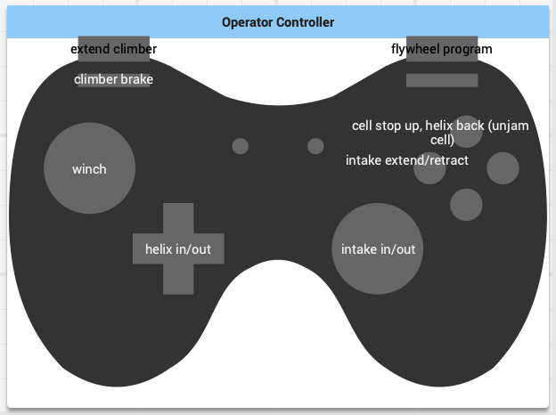
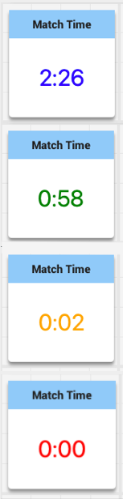
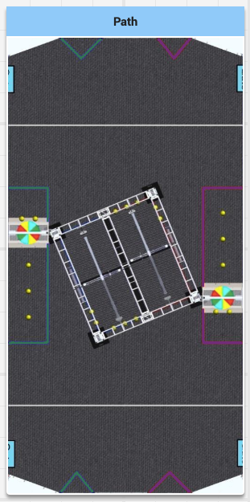

# Shiny Plugin

A plugin for Shuffleboard that includes my homemade widgets, currently containing a widget for displaying the function of an Xbox controller, a widget displaying the time remaining in the match, and a widget displaying the autonomous path.

## Installation

Download the .jar file from [the latest release](https://github.com/Knaoinr/shiny-plugin/releases/) and drag it into the folder `~Shuffleboard/plugins`. This should work with any JDK version 11+.

## Usage

Drag and drop widgets to see what they look like, and right click > Edit Properties to see their properties.
All of these can be adjusted in the code by using the property string name. See the official shuffleboard documentation for examples.

### Xbox Controller



The button labels are all set as properties. To see their names, right click, then use `withProperties` to set them.

Although this isn't its main purpose, you can also use this widget to check button inputs. The Xbox controller widget takes in a boolean array as its data, up to 13 booleans, each representing whether the button is pressed:
* 0: A
* 1: B
* 2: X
* 3: Y
* 4: LB
* 5: RB
* 6: LS
* 7: LR
* 8: Left joystick
* 9: Right joystick
* 10: Left trigger
* 11: Right trigger
* 12: POV

When the boolean at this index is true, the specified button will light up. The default is false for all of these.

### Match Time



The timer widget takes in a double as its data, the data type returned by `DriverStation.getInstance().getMatchTime()`. This method returns the time left in the current period, so be sure to add the length of teleop & endgame to this number if you're in auto. Also be aware that this method only returns an approximate time, not the official time.

The timer currently changes colors from purple (Match not started) -> blue (Autonomous) -> Green (Teleop) -> Orange (Endgame) -> Red (Match over).
You can disable the color changes as a setting. You can also change the lengths of each period as a setting. Currently, the lengths are set to the 2020 season (15 sec auto & 30 sec endgame over 2:30 min total).

Recommended code:

```java
timerWidget.setDouble(DriverStation.getInstance().getMatchTime() + (DriverStation.getInstance().isAutonomous() ? 135 : 0));
```

### Path



To draw a path on this map, set the path widget's data to an array of pairs of doubles, each representing a coordinate in the path. (0, 0) is in the top left corner of the map. The default configuration uses inches, but you can change this by setting the field width & height to whatever units you would like, e.g. set it to 10 using feet instead of 120 using inches.

Currently, the field map and size are set to the 2020 season; however, you can change this by setting the year and field size as properties. If you are setting this to a year other than 2020, you'll need to add a map image to src/main/resources/com/knaoinr/customwidgets/widget/path called \[year\].png. Feel free to simply take a screenshot from the game manual and turn it right way up.